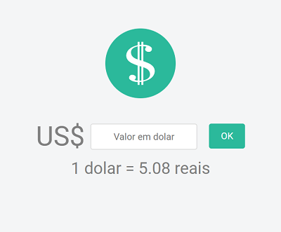
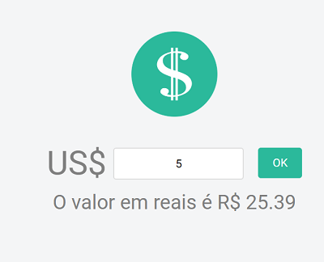

# Dolar Cotado

Essa é uma aplicação que converte dolar em real usando a cotação atual do dolar.
Obti a cotação atual do dolar através da [API de moedas da AwesomeAPI](https://docs.awesomeapi.com.br/api-de-moedas) e na criação da estilização do site utilizei a biblioteca [Butter Cake](https://getbuttercake.com/)

#### Print ao abrir aplicação

#### Print ao calcular algum valor

